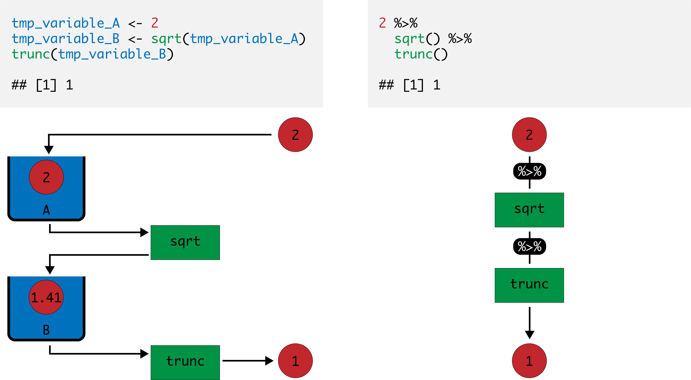

# Tidyverse


## Recap

**Prev**: Core concepts

- Variables
- Functions
- Libraries

**Now**: Tidyverse

- Tidyverse libraries
- *pipe* operator


## Tidyverse

The [Tidyverse](https://www.tidyverse.org/) was introduced by statistician [Hadley Wickham](https://t.co/DWqWlxbOKK?amp=1), Chief Scientist at [RStudio](https://rstudio.com/) (worth following him on [twitter](https://twitter.com/hadleywickham)).

*"The tidyverse is an opinionated collection of R packages designed for data science. All packages share an underlying design philosophy, grammar, and data structures."* ([Tidyverse homepage](https://www.tidyverse.org/)).

**Core libraries**

:::::: {.cols data-latex=""}

::: {.col data-latex="{0.5\textwidth}" style="width: 50%"}


- [`tibble`](https://tibble.tidyverse.org/)
- [`tidyr`](https://tidyr.tidyverse.org/)
- [`stringr`](https://stringr.tidyverse.org/)
- [`dplyr`](https://dplyr.tidyverse.org/)


:::

::: {.col data-latex="{0.5\textwidth}" style="width: 50%"}

- [`readr`](https://readr.tidyverse.org/)
- [`ggplot2`](https://ggplot2.tidyverse.org/)
- [`purrr`](https://purrr.tidyverse.org/)
- [`forcats`](https://forcats.tidyverse.org/)

:::
::::::

Also, imports [`magrittr`](https://magrittr.tidyverse.org/), which plays an important role.

## Tidyverse core libraries

The meta-library [Tidyverse](https://www.tidyverse.org/) includes:

- **[`tibble`](https://tibble.tidyverse.org/)** is a modern re-imagining of the data frame, keeping what time has proven to be effective, and throwing out what it has not. Tibbles are data.frames that are lazy and surly: they do less and complain more forcing you to confront problems earlier, typically leading to cleaner, more expressive code. 
- **[`tidyr`](https://tidyr.tidyverse.org/)** provides a set of functions that help you get to tidy data. Tidy data is data with a consistent form: in brief, every variable goes in a column, and every column is a variable.
- **[`stringr`](https://stringr.tidyverse.org/)** provides a cohesive set of functions designed to make working with strings as easy as possible. It is built on top of stringi, which uses the ICU C library to provide fast, correct implementations of common string manipulations. 


## Tidyverse core libraries

The meta-library [Tidyverse](https://www.tidyverse.org/) includes:

- **[`dplyr`](https://dplyr.tidyverse.org/)** provides a grammar of data manipulation, providing a consistent set of verbs that solve the most common data manipulation challenges. 
- **[`readr`](https://readr.tidyverse.org/)** provides a fast and friendly way to read rectangular data (like csv, tsv, and fwf). It is designed to flexibly parse many types of data found in the wild, while still cleanly failing when data unexpectedly changes. 
- **[`ggplot2`](https://ggplot2.tidyverse.org/)** is a system for declaratively creating graphics, based on The Grammar of Graphics. You provide the data, tell ggplot2 how to map variables to aesthetics, what graphical primitives to use, and it takes care of the details.


## Tidyverse core libraries

The meta-library [Tidyverse](https://www.tidyverse.org/) contains the following libraries:

- **[`purrr`](https://purrr.tidyverse.org/)** enhances R’s functional programming (FP) toolkit by providing a complete and consistent set of tools for working with functions and vectors. Once you master the basic concepts, purrr allows you to replace many for loops with code that is easier to write and more expressive. 
- **[`forcats`](https://forcats.tidyverse.org/)** provides a suite of useful tools that solve common problems with factors. R uses factors to handle categorical variables, variables that have a fixed and known set of possible values.


## The pipe operator

The [Tidyverse](https://www.tidyverse.org/) (via [`magrittr`](https://magrittr.tidyverse.org/)) also provide a clean and effective way of combining multiple manipulation steps

The pipe operator `%>%`

- takes the result from one function
- and passes it to the next function
- as the **first argument**
- that doesn't need to be included in the code anymore


## Pipe example
<center>
{width=100%}
</center>


## Pipe example

The two codes below are equivalent

- the first simply invokes the functions
- the second uses the pipe operator `%>%`


```r
round(sqrt(2), digits = 2)
```

```
## [1] 1.41
```


```r
library(tidyverse)

sqrt(2) %>%
 round(digits = 2)
```

```
## [1] 1.41
```


## Coding style

A *coding style* is a way of writing the code, including

- how variable and functions are named
    - lower case and `_`
- how spaces are used in the code
- which libraries are used


```r
# Bad
X<-round(sqrt(2),2)

#Good
sqrt_of_two <- sqrt(2) %>%
 round(digits = 2)
```

Study the [Tidyverse Style Guid](http://style.tidyverse.org/) and use it consistently!


## Summary

Tidyverse

- Tidyverse libraries
- *pipe* operator
- Coding style

**Next**: Practical session

- The R programming language
- Interpreting values
- Variables
- Basic types
- Tidyverse
- Coding style


