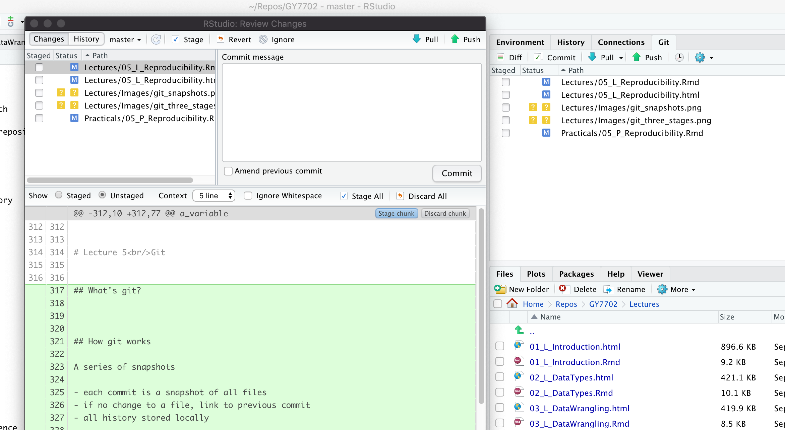

# Git

## Recap

RMarkdown

- Markdown
- RMarkdown

**Next**: Git

- Git operations
- Git and RStudio

## What's git?

**Git** is a free and opensource version control system

- commonly used through a server
    - where a master copy of a project is kept
    - can also be used locally
- allows storing versions of a project
    - syncronisation
    - consistency
    - history
    - multiple branches

## How git works

A series of snapshots

- each commit is a snapshot of all files
- if no change to a file, link to previous commit
- all history stored locally

{width=80%}

 

<a href="https://git-scm.com/book/en/v2/Getting-Started-What-is-Git%3F">by Scott Chacon and Ben Straub</a>, licensed under <a href="https://creativecommons.org/licenses/by-nc-sa/3.0/">CC BY-NC-SA 3.0</a>

## Three stages

When working with a git repository

- first checkout the latest version
- select the edits to stage
- commit what has been staged in a permanent snapshot

{width=60%}

 

<a href="https://git-scm.com/book/en/v2/Getting-Started-What-is-Git%3F">by Scott Chacon and Ben Straub</a>, licensed under <a href="https://creativecommons.org/licenses/by-nc-sa/3.0/">CC BY-NC-SA 3.0</a>

## Basic git commands

- `git clone`
    - copy a repository from a server
- `git fetch`
    - get the latest version from a branch
- `git pull`
    - incorporate changes from a remote repository
- `git add`
    - stage new files
- `git commit`
    - create a commit
- `git push`
    - upload commits to a remote repository

## Git and RStudio

RStudio includes a git plug-in

- clone R projects from repositories
- stage and commit changes
- push and pull changes

{width=70% style="border: 1px solid black"}

## Summary

Git

- Git operations
- Git and RStudio

**Next**: Practical

- Reproducibile data analysis
- RMarkdown
- Git

